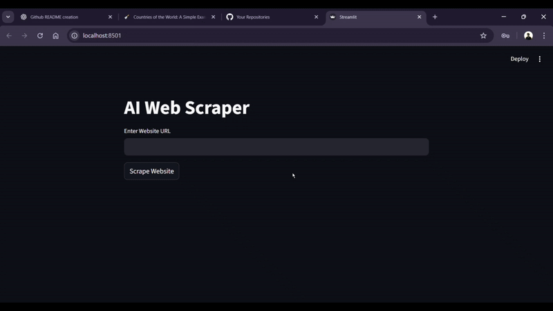

# Scrappy AI: Intelligent Web Scraper & Parser

[](https://www.python.org/)
[](https://streamlit.io/)
[](https://www.selenium.dev/)
[](https://ai.google.dev/)

An end-to-end, AI-powered web scraping and data extraction application. The core engine integrates **Selenium WebDriver** for executing dynamic Javascript-heavy webpages, **BeautifulSoup4** for sanitizing and preprocessing DOM tree nodes, and the **Google Gemini API** (`gemini-2.5-flash`) for zero-shot semantic information extraction. The application features an interactive, modern user interface built using **Streamlit** to streamline structured parsing workflows.

---

## 📸 Application Preview

<p align="center">
  
</p>

---

## 🌟 Key Features

* **Dynamic JS Web Scraping**: Launches a Chrome browser instance using Selenium to execute dynamic scripts, allowing access to websites that render content on the client side.
* **Automated DOM Sanitization**: BeautifulSoup pipeline strips out noisy HTML elements (such as `<script>` and `<style>` tags) and processes text spacing, isolating readable payload strings.
* **Smart Context Chunking**: Automatically fragments large text buffers into 6,000-character segments, preventing context-window exhaustion and token overflow limitations during API execution.
* **AI-Powered Semantic Parsing**: Leverages the official Google GenAI SDK and `gemini-2.5-flash` model to query, interpret, and extract structured data based on natural language queries.
* **Unified Streamlit GUI**: A clean, single-page reactive dashboard featuring side-by-side interactive views for raw DOM previews and AI parsed responses.

---

## 🛠️ Technology Stack

* **Core Language**: Python 3.9+
* **Frontend UI Framework**: Streamlit
* **Browser Automation**: Selenium WebDriver
* **HTML & DOM Processing**: BeautifulSoup (bs4) with `lxml` and `html5lib` parsers
* **LLM Core**: Google GenAI API Client
* **Configuration Management**: python-dotenv

---

## ⚙️ System Workflow Diagram

```text
  [User enters Website URL]
             │
             ▼
  [Selenium Chrome Driver launches]
             │
             ▼
  [Load URL & sleep 10s for JS execution]
             │
             ▼
  [Extract raw HTML page_source]
             │
             ▼
  [BeautifulSoup extracts <body> tag]
             │
             ▼
  [Filter out <script> & <style> tags]
             │
             ▼
  [Normalize layout spacing & strip whitespace]
             │
             ▼
  [Save to st.session_state & render DOM preview]
             │
             ▼
  [User inputs parsing instructions (e.g. Extract pricing)]
             │
             ▼
  [Split sanitized DOM content into 6,000-char chunks]
             │
             ▼
  [Loop chunks through Gemini API (gemini-2.5-flash)]
             │
             ▼
  [Concatenate results & display parsed outputs in UI]
```

---

## 📂 Project Structure

```text
Scrappy_AI/
├── Scrape.py            # Selenium browser initialization and BeautifulSoup cleanup
├── main.py              # Streamlit frontend layout and interactive state management
├── parse.py             # Google GenAI model interaction and chunked prompt routing
├── requirements.txt     # Locked project dependencies
├── chromedriver.exe     # Binary driver for Google Chrome browser execution
├── Demo.gif             # Animated dashboard demonstration file
└── .env.example         # Template file for secret environment variables
```

---

## 🚀 Getting Started

### 1. Installation

Clone this repository and navigate to the project root:
```bash
git clone https://github.com/your-username/Scrappy_AI.git
cd Scrappy_AI
```

Create a virtual environment and activate it:
```bash
# Windows
python -m venv venv
venv\Scripts\activate

# macOS / Linux
python3 -m venv venv
source venv/bin/activate
```

Install the dependencies:
```bash
pip install -r Scrappy_AI/requirements.txt
```

### 2. Chrome & WebDriver Setup
1. Verify that **Google Chrome** is installed on your local computer.
2. Download the matching **ChromeDriver** version that corresponds to your installed Chrome browser from the [Chrome for Testing](https://googlechromelabs.github.io/chrome-for-testing/) portal.
3. Place `chromedriver.exe` (or `chromedriver` on macOS/Linux) inside the `Scrappy_AI/` folder.

### 3. Environment Configuration
Create a `.env` file in the `Scrappy_AI/` directory:
```bash
# Copy the template file
cp Scrappy_AI/.env.example Scrappy_AI/.env
```
Open `.env` and fill in your Gemini API key:
```env
API_KEY=your_google_gemini_api_key_here
```

---

## 🏋️ Scraping & Extraction Workflow

Launch the Streamlit web server:
```bash
streamlit run Scrappy_AI/main.py
```

### User Interface Guide:
1. **Scrape Webpage**: Enter the full URL of the website you wish to parse (e.g., `https://example.com/products`) and click **Scrape Website**.
2. **View Cleaned DOM**: The app displays the sanitized text payload inside an interactive, scrollable Streamlit expander.
3. **Configure Parsing Instructions**: Describe the specific data points you want to extract inside the input text area (e.g., *Extract all product titles, descriptions, and price values into a markdown table*).
4. **Initiate Extraction**: Click **Parse Content**. The engine chunks the DOM and queries the Gemini model, returning the structured extraction results in the UI.

---

## 🔮 Future Improvements

1. **WebDriver Auto-Management**: Integrate `webdriver-manager` to dynamically fetch the correct Chrome binaries, eliminating manual ChromeDriver installation.
2. **Headless Execution**: Add an option in the UI to run Chrome in headless mode (`--headless`) to reduce CPU consumption.
3. **Structured Export Formats**: Add download buttons in Streamlit to export parsed markdown directly into JSON, CSV, or Excel formats.
4. **Smart Element Waits**: Replace the hardcoded `10s` delay with Selenium's dynamic `WebDriverWait` (Expected Conditions) to check for page load indicators.
